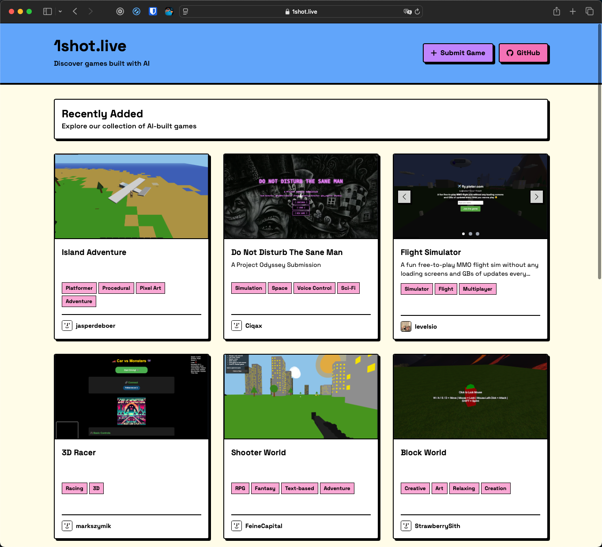

# Submit Hunt

A directory for Startups and AI projects. Launch and discover innovative startups and side-projects.

## Features

- Browse and discover innovative startups and AI projects
- Submit your own projects to the directory
- Upvote your favorite projects
- Share projects with others via direct links

## Development

### Getting Started

1. Clone the repository
2. Install dependencies: `npm install` or `bun install`
3. Run the development server: `npm run dev` or `bun run dev`

### Placeholder Data

The application includes placeholder data for demonstration purposes. This data is used automatically if no Supabase connection is available or if the Supabase database is empty.

You can find the placeholder data in `src/lib/placeholder-data.js`.

### Supabase Integration

To connect to Supabase:

1. Create a `.env` file based on `.env.example`
2. Add your Supabase URL and API key
3. The application will automatically use Supabase data if available
